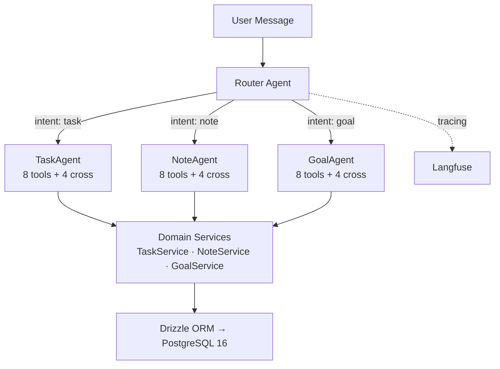

# Agent CRUD

**A full-stack app where AI agents are a first-class interface and orchestrated by a router agent.**

Users manage tasks, notes, and goals through Kanban boards, forms, and search **or** by chatting with specialized AI agents that understand their data. Both interfaces share the same domain logic, validation, and data layer.

**[Demo Replay](https://agent-crud.web.app)** — pre-recorded demo deployed on Firebase, run it locally to test it out fully, instructions are available below.


https://github.com/user-attachments/assets/e18241e0-38de-4a57-8937-b9e2c2fad483


---

## Architecture

**Router-and-delegate multi-agent system** — each domain has its own specialized agent with scoped tools, isolated mutation rights, and a purpose-built system prompt. Every interaction is traced with Langfuse.



### Why Multi-Agent

- **Focused context windows** — Each agent only sees tools and instructions relevant to its domain. A TaskAgent never sees goal-related tools, so it can't hallucinate milestone operations.
- **Intent-based routing, not keyword matching** — The Router Agent classifies what the user wants to *do*, not what words they used. "Note to self: buy milk" routes to NoteAgent. "My goal is to buy groceries" routes to TaskAgent (it's a to-do, not a life goal).
- **Cross-domain awareness without cross-domain mutation** — Each agent can *read* across all domains for context, but can only *write* to its own.
- **Clean separation of concerns** — Adding a new domain means creating a new agent, tools, and prompt — no changes to existing agents. The router picks it up automatically.

### How Routing Works

| User says | Routed to | Why |
|-----------|-----------|-----|
| "Add a task to buy milk" | TaskAgent | Direct task creation |
| "Note to self: buy milk" | NoteAgent | Idiom — means "record this" |
| "My goal is to finish the report" | TaskAgent | Colloquial "goal" — actually a to-do |
| "I want to get better at running" | GoalAgent | Long-term aspiration |
| "Translate that to Spanish" | *Previous agent* | Follow-up — applies to last action |
| "Create a task AND a note about it" | TaskAgent | Primary domain; cross-domain tools for the note |
| "Don't create a task, just make a note" | NoteAgent | Negation — routes to the *wanted* domain |

The router never refuses. When intent is ambiguous, it delegates to its best guess rather than asking clarifying questions.

### Agent Tools

Each domain agent has **8 core tools** + **4 cross-domain tools** (32 tools system-wide):

| Core tools | Cross-domain tools |
|---|---|
| `list`, `get_by_id`, `search`, `statistics` | `search_other_{domain}` (read-only) |
| `create`, `update`, `delete`, domain-specific | `create_other_{domain}` (write) |

Tools are thin wrappers around domain services, wrapped with `safeExecute` for graceful error handling.

### Streaming & Entity Cards

Chat responses stream via the Google ADK event system. When an agent creates or modifies data, the tool response is parsed into a **structured entity card** (task-card, note-card, goal-card) and rendered inline in the conversation. A **routing badge** shows which agent handled the request.

### Observability with Langfuse

Every chat interaction is traced end-to-end with **[Langfuse](https://langfuse.com)** — input, output, agent routing, tool calls, and latency. Traces flush asynchronously with a 3-second timeout so observability never blocks the response. Run Langfuse locally via `pnpm infra:up` (included in the infra stack) or connect to Langfuse Cloud. Langfuse is optional.

---

## Tech Stack

| Layer | Tech |
|-------|------|
| **Frontend** | React 19, Vite, Tailwind CSS, TanStack Query, React Hook Form + Zod |
| **Backend** | Express.js, tRPC v11, Drizzle ORM, PostgreSQL 16 |
| **AI** | Google Gemini via @google/adk |
| **Observability** | Langfuse (tracing, latency, tool calls) |
| **Type Safety** | End-to-end via tRPC — Zod validates at every boundary |

---

## Features

**AI Chat**
- Multi-agent system with intent-based routing
- Streaming responses with inline entity cards
- Cross-domain awareness with scoped mutation rights
- Persistent conversation history with auto-generated titles
- Conversation summarization for long chats

**CRUD & UI**
- Kanban boards organized by status/category per domain
- Full search, filter, and sort across all domains
- Goal tracking with nested milestones and progress bars
- Keyboard shortcuts — `Cmd+K` (search), `Cmd+N` (new), `g+t/n/w` (navigate)
- Mobile-responsive with adaptive sidebar and drawer panels

**Demo Mode**
- Built-in automated demo that showcases the full agent system
- Click "Demo Mode" in the bottom-right of the chat page to start
- 12 sequential prompts: CRUD, goals with milestones, cross-domain queries, batch operations, search, and conversational intelligence
- Pause, resume, skip, or stop at any time

---

## Getting Started

### Prerequisites

- Node.js 20+
- pnpm
- Docker
- [Google Gemini API key](https://aistudio.google.com/apikey)
- Langfuse (optional — for tracing, runs locally via `pnpm infra:up` or use [Langfuse Cloud](https://langfuse.com))

### Setup

```bash
git clone https://github.com/uid4oe/agent-crud.git && cd agent-crud
pnpm install

# Configure environment
cp .env.example .env
# Add your GEMINI_API_KEY to .env
# Optionally add LANGFUSE_SECRET_KEY, LANGFUSE_PUBLIC_KEY, LANGFUSE_BASE_URL

# Start PostgreSQL + Langfuse, push schema, launch dev servers
pnpm infra:up
pnpm db:push
pnpm dev
```

The app will be running at [http://localhost:5173](http://localhost:5173).

```bash
pnpm db:seed    # Optional: populate with sample data
```

---

## Scripts

| Command | Description |
|---------|-------------|
| `pnpm dev` | Start backend (3000) + frontend (5173) |
| `pnpm build` | Build both packages |
| `pnpm infra:up` | Start PostgreSQL + Langfuse via Docker |
| `pnpm infra:down` | Stop PostgreSQL + Langfuse |
| `pnpm db:push` | Push schema directly to database (dev) |
| `pnpm db:migrate` | Run Drizzle migrations |
| `pnpm db:generate` | Generate migrations from schema changes |
| `pnpm db:seed` | Seed database with sample data |
| `pnpm db:reset` | Drop all tables and recreate schema from scratch |
| `pnpm format` | Sort imports across codebase (via Biome) |
| `pnpm format:check` | Check import sorting without modifying (for CI) |

---

## License

MIT
